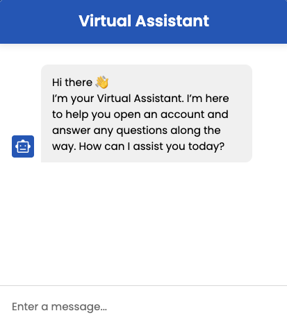
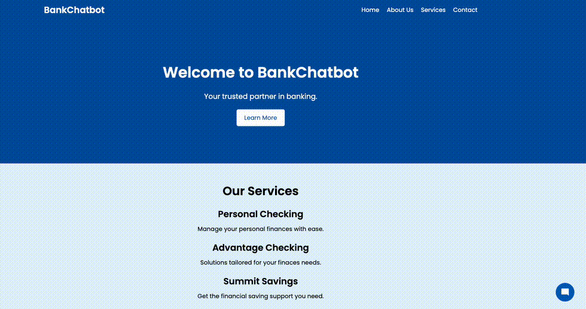
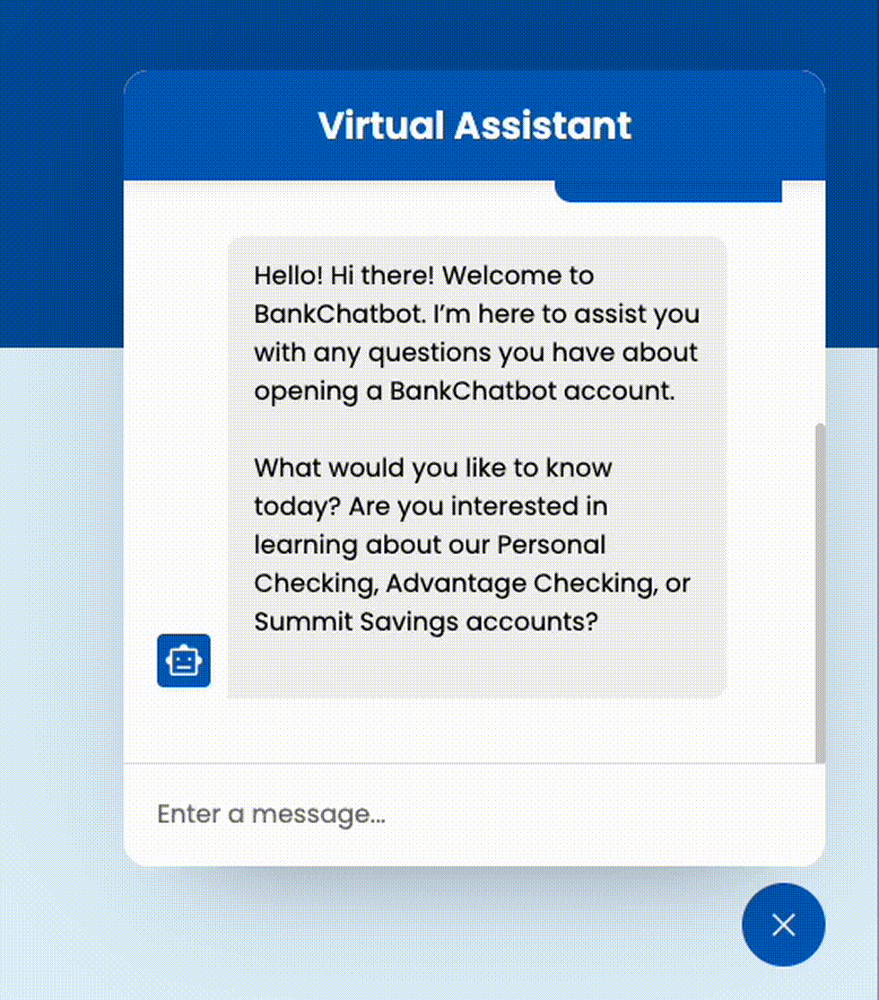
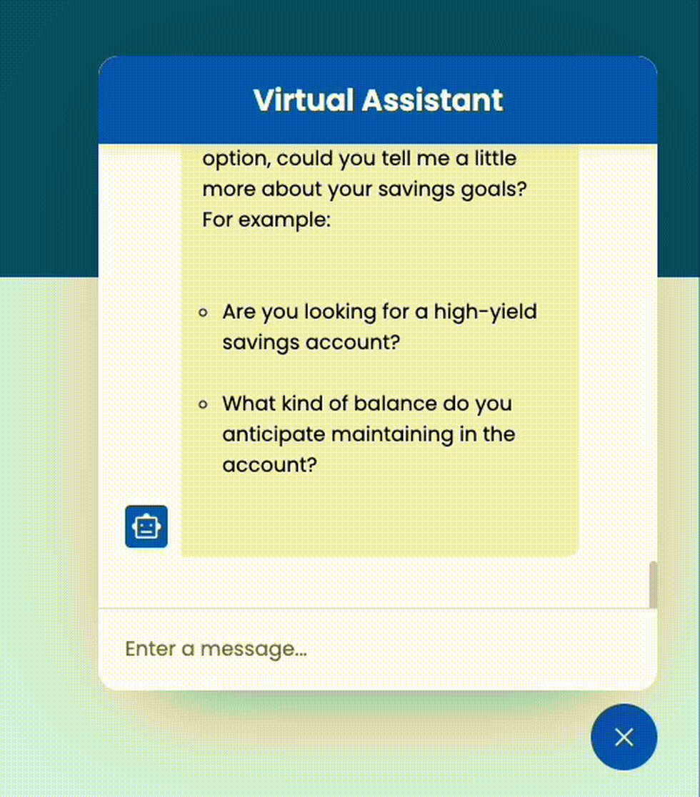
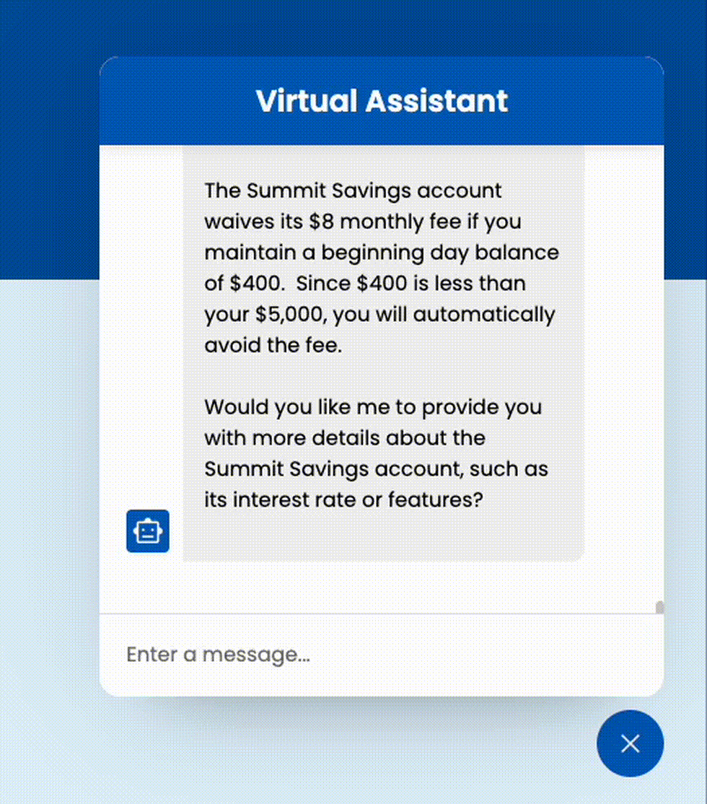

# BankChatBot

BankChatBot is a learning project designed to demonstrate the potential use of Local Language Models (LLMs) for customer service in a banking environment. This project shows how you can run a customer-specific LLM locally, providing AI-powered chatbot functionality with Ollama. It serves as a valuable starting point for anyone looking to learn how to set up a custom LLM for various use cases, such as banking or other industries.

## Features

- Demonstrates how to run a local LLM and use it for a bank chatbot.
- Interactive chatbot interface for simulating bank-related customer queries.
- Potential to adapt and build any custom LLM for different industries or use cases.

## Setup Instructions

### Prerequisites

1. **Install Ollama (Optional)**  
   If you don’t have Ollama installed, you can follow these instructions to set it up locally:

   - **macOS**: 
     ```
     brew install ollama
     ```
   - **Windows/Linux**:  
     Follow the installation steps on [Ollama's official website](https://www.ollama.com/) for your respective platform.

2. **Node.js**  
   You’ll need Node.js installed to run the chatbot UI. You can download it from [here](https://nodejs.org/).

### Step-by-step Setup

1. **Set Up Ollama for Local AI**  
   Start Ollama to serve AI responses locally by running the following command in your terminal:

This will start the Ollama server, making it available for interactions from the BankChatBot UI.

2. **Download a Language Model**

Ollama offers a straightforward way to download and manage open source language models directly on your local machine. For this project setup, you need to download the Gemma3 model with 4 billion parameters. Use the following command to initiate the download:

  ```bash
  ollama pull gemma3:4b
  ```

3. **Create the Custom BankChatbotModel from ModelFile**  
After starting Ollama, create the custom BankChatbotModel to handle the chatbot queries. The model file will configure the chatbot for the specific use case of bank-related questions.

- To create the model, run the following command:
  ```
  ollama create BankChatbotModel -f ModelFile
  ```

This command will use the provided `ModelFile` already in the repo to create the custom model for the chatbot.

4. **Run the Node.js Server for the Chatbot UI**  
Start the local chatbot UI by running the following commands:

- Install dependencies:
  ```
  npm install
  ```
- Start the Node.js server:
  ```
  npm start
  ```

The chatbot UI will be accessible at `http://localhost:4000`.

5. **Start the Optional `ollamaForwarder.js` (for running the chatbot on a different domain)**  
If you are running the chatbot UI and Ollama on separate domains or different servers, you can start the optional `ollamaForwarder.js` script to forward the requests to your Ollama instance.

- To start the forwarder, run:
  ```
  node ollamaForwarder.js
  ```

This will ensure the UI can communicate with the Ollama instance even if they are running on different domains. If you are running both on `localhost`, you don’t need to use this script as the UI can directly access the local Ollama instance.

### Demo

The following demo GIFs illustrate the functionality and features of the BankChatBot:

1. **Starting the Chatbot UI and Initiating the Conversation**  
This GIF demonstrates the chatbot UI loading and initiating a conversation with the customer.



2. **Assisting with Account Opening Questions**  
This GIF shows the chatbot handling queries related to opening a bank account, showcasing its ability to address common customer questions.


3. **Smart AI Response to Account Opening Queries**  
This GIF highlights the chatbot’s intelligent response when a customer asks about account opening. The AI provides a helpful and informative reply.


4. **Restricted Assistance Based on Configured Roles**  
This GIF demonstrates how the chatbot restricts its responses based on pre-configured roles. For example, the chatbot may limit assistance to account opening questions only.


---

## Contributing

Feel free to contribute to the project by submitting issues and pull requests. If you have ideas for new features or improvements, we welcome your contributions!

## License

This project is licensed under the MIT License.
